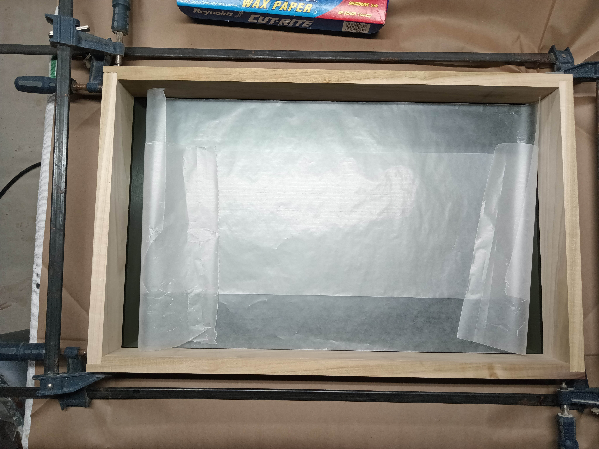

# Abby's Mirror: Build Log

This page is a rough build log some steps may have been ommited but this should get you pointed in the right direction.

<hr>

## Operating System

Install orangepi version of headless Debian (bookworm)

    dd if=[start.img] of=/dev/sdx bs=8M && sync

Boot the device, first boot will take a moment as the FS expands etc. 
Login via ssh or local tty to complete the remaining. 

### Update passwords

Update the passwords for the orangepi and root accounts (recommended)

    passwd 
    sudo su 
    passwd

### Fix Vim

    vim ~/.vimrc
        set tabstop     =2
        set softtabstop =2
        set shiftwidth  =1
        set expandtab
        syntax on


### Swap out the sources and sources.d stuff because Huawei and shady**

(recommended)

    vim /etc/apt/sources.list
        deb http://deb.debian.org/debian bookworm main non-free-firmware
        deb-src http://deb.debian.org/debian bookworm main non-free-firmware

        deb http://deb.debian.org/debian-security/ bookworm-security main non-free-firmware
        deb-src http://deb.debian.org/debian-security/ bookworm-security main non-free-firmware

        deb http://deb.debian.org/debian bookworm-updates main non-free-firmware
        deb-src http://deb.debian.org/debian bookworm-updates main non-free-firmware

    rm /etc/apt/sources.d/docker.list

### Disable Docker

Telemetry, docker not used

    systemctl disable docker containerd

## Update everything

Update the core system

    apt update 
    apt upgrade
    
### Get some needed stuff

    sudo apt install xinit xserver-xorg x11-xserver-utils samba avahi-daemon npm

<hr>

## Magic Mirror

Clone the repo, install dependencies, create a basic confg / configure

    git clone https://github.com/MichMich/MagicMirror
    sudo apt install libatk1.0-0 libgtk-3-0 libgbm1 libnss3
    cd MagicMirror
    npm install
    cp ./config/config.js.sample ./config/config.js

Add more modules:
  * Compliments Plus
  * Rain map
  * Remote
  * BackgroundSlideshow
  * Upload some pro fonts 

### Own /dev/tty2 at boot

Take ownership of tty2 at boot so that X can be started manually for a single app

as root:

    crontab -e
        @reboot chown orangepi:orangepi /dev/tty2 

Run this command now if you need to test before rebooting. 

### Whip up a simple xinitrc
    
Disables screensaver and starts X and mirror on primary display

    vim ~/.xinitrc
        xset dpms 0 0 0 && xset s noblank  && xset s off
        cd ./MagicMirror
        DISPLAY=:0 npm start

### Create a startup script for PM2

    vim mm.sh
        startx
    chmod +x mm.sh

### Install PM2

    sudo npm install -g pm2
    pm2 start mm
    pm2 save

<hr>

## Checkpoint

At this point you should have an auto starting Magic mirror on headless Debian with minial X.

How minimal?


<hr>

## Extra Credit

### GPIO cooling fan 

Wire up an NPN transistor as shown to use as a driver. 


e.g. 2n222 with 1K(ish) base resistor.

create a driver script and start at boot e.g. below 

    #!/bin/bash
    fanPin="6"
    onTemp=45000
    offTemp=40000
    gpio mode $fanPin out 
    getTemp() {
        while IFS= read -r line
        do
            #echo $line
        done < '/sys/devices/virtual/thermal/thermal_zone0/temp'
    }
    while true 
    do      
        temp=$(getTemp)
        #echo $temp
        if [ $temp -gt $onTemp ]; then 
            state=1
            gpio write $fanPin $state
        fi
        if [ $temp -lt $offTemp ]; then 
            state=0
            gpio write $fanPin $state
                
        fi
        sleep 5
    done    

Run the script at boot...

    crontab -e 
        @reboot /home/orangepi/Scripts/fan_monitor.sh >/dev/null 2>&1 & disown 


Please note this example uses gpio vs a python library because keeping python up to date is a full time job. I also learned there is this whole internet nerd fight about accessing hardware via the file system userspace or kernel. 

### GPIO inputs 
Input switches were wired as shown and a simple poll script was created. 


*bottom lead is commong ground others go to switch pins*

```
#!/bin/bash

shutdownPin=9
restartPin=10

gpio mode $shutdownPin in
gpio mode $shutdownPin up

gpio mode $restartPin in
gpio mode $restartPin up

# Wait for startup etc to finish
sleep 30

while [ 1 -eq 1 ]
do
  if [ $(gpio read 9) -eq "0" ]; then
    sudo shutdown -h 0
    #echo "shutdown"
    #echo "shutdown" > ~/Scripts/input_monitor.log
  fi
  if [ $(gpio read 10) -eq "0" ]; then
    . ~/.bashrc
    cd ~/MagicMirror
    pm2 restart mm &> input_monitor.log
    #echo "restart mm" >> ~/Scripts/input_monitor.log
  fi
  sleep .2
done
```

Start the script at boot. 
```
crontab -e
    @reboot ~/Scripts/input_monitor.sh >/dev/null 2>&1 & disown
```
<hr>

## Frame 

Full credit to Jim Deaver for making a beautiful frame from Poplar and Cherry. 

|  |  |  |
| :---: | :---: | :---: |
| Glass fitted | Parts layout | Frame assembled |

|  |  | 
| :---: | :---: | 
| Unfinished | Finished |

<hr>

## Additional 

Some 3D Printed parts were created to help keep things tidy. 


*Files can be found [here](../Print.md) if needed* 

<hr>

## Assembly Process 

 

<hr>

## Internals

  
