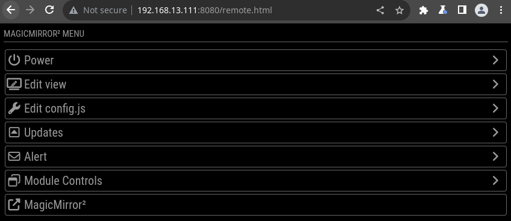
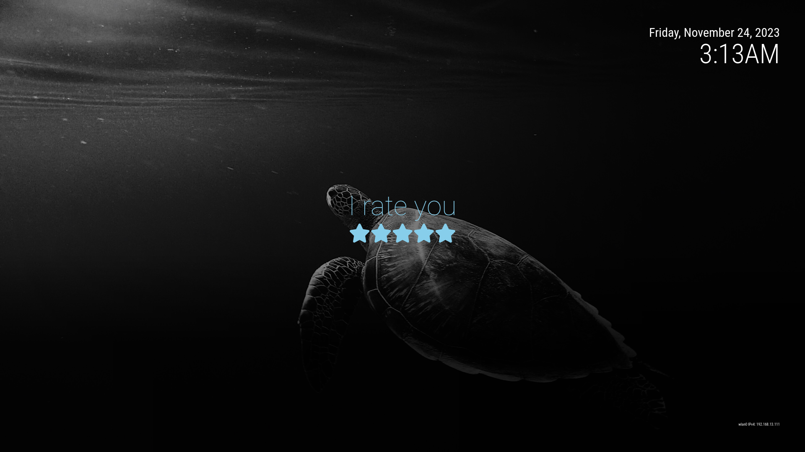

# Abby's Mirror: Usage Guide

This page describes how to use the mirror and all of it's features. 

## Power and Network

Power on the mirror via the connector and switch located on the bottom of the mirror. 

The mirror will join known wireless networks automatically. Use the LAN connector near the power switch if needed.

*Please use the external buttons to cleanly shutdown the mirror prior to turning the switch off*

## External Buttons

  * Press the green button to restart the mirror application only
  * Press the red button to shutdown the mirror 
    * The screen will fill with text, when it says Target shutdown reached it's OK to turn the power off

## LEDs 

Your mirror has LEDs, use the included remote. 

## General Usage 
The mirror should boot and find the network on it's own. Once on the network the IP address will be displayed in the lower right hand corner. 

*The IP address is how you "find" the mirror on your network. You'll need this address to use things like the web interface and file sharing.*

### Web Interface

Your mirror has a web control interface that you you can access while on the same local network (wifi). Using this interface you can configure which modules are shown, set the brightness of the mirror, send it alerts, turn it off, etc. 

Access the mirrors remote webpage via the **ip address** + **:8080/remote.html** 

This will likely work too on everything but Android **abby_mirror.local:8080/remote.html** 

e.g. 
  * [http://abbymirror.local:8080/remote.html](http://abbymirror.local:8080/remote.html)
  * http://192.168.13.111:8080/remote.html

Read more about this module here https://github.com/Jopyth/MMM-Remote-Control

### Background Images

Your mirror can display background images as a slideshow. 

Enable this module via the Web Interface to use. (Located under the edit view option)

Place images into the *Background Images* shared folder to include them in the Background images rotation. 

## Advanced Usage

Items below this point will require some form of authentication, use of username(s), password(s), and key(s) that came on the letter with your mirror. 

### File Sharing 

Your mirror works as network file server. You should be able to find it from another PC by searching "Network". 

Use the file share user name and password that came in the letter with your mirror.

### SSH 

You can access the operating system of your mirror via a standard SSH connection. Use the SSH username and password provided in the letter that came with your mirror. 

Read more about SSH here: https://www.openssh.com/

### API 

Your mirror has a fully functional API that you can use to build your own applications or control however you please. 

e.g.
 

Use the api key that came in the letter with your mirror. 

Read more about the API config here: https://documenter.getpostman.com/view/6167403/Rzfni66c

