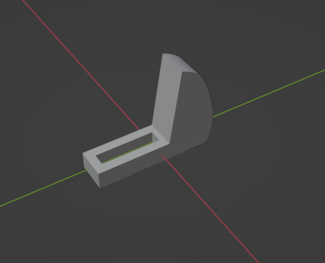
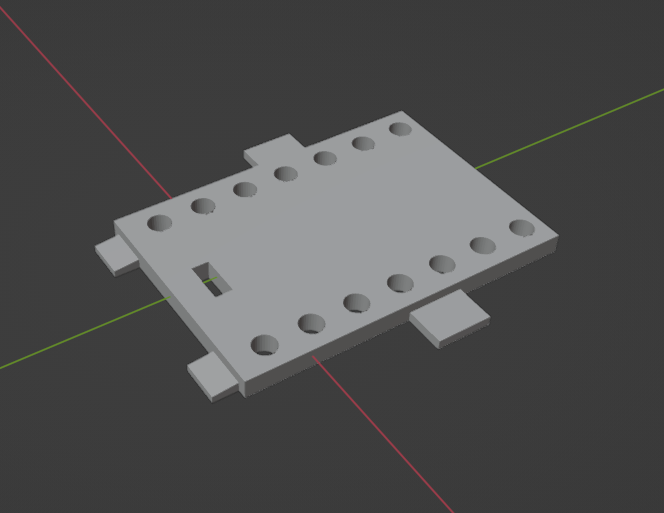
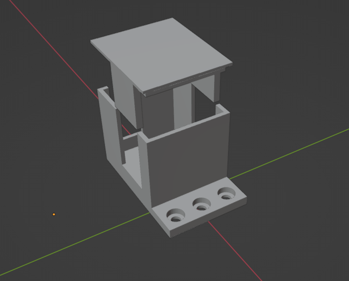
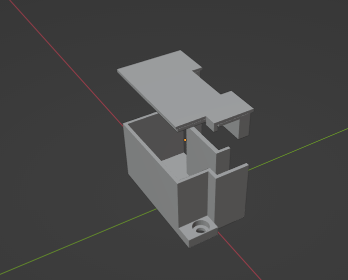
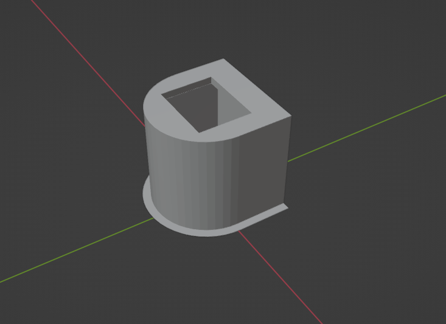
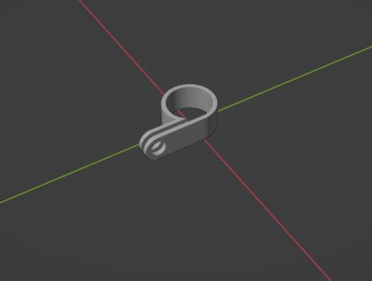

# Abby's Mirror: Print Files

This page is just an index of custom 3D printed parts used in construction in case replacements are needed.  

| Desc | Image | 
| :---: | :---: | 
| [Monitor clamps](./print/MonitorClamp.stl) |  | 
| [Monitor mount plate](./print/MonitorMountBase.stl) |  | 
| [PWM housing](./print/PWMHousing.stl)   [PWM Housing Lid](./print/PWMHousingLid.stl) |   | 
| [5v transformer housing](./print/TransformerHousing.stl)   [5v transformer housing lid](./print/TransformerHousingLid.stl) |  | 
| [LAN](./print/LAN.stl) |  | 
| [Clamp](./print/CableClamp_10_11.stl) |  | 
