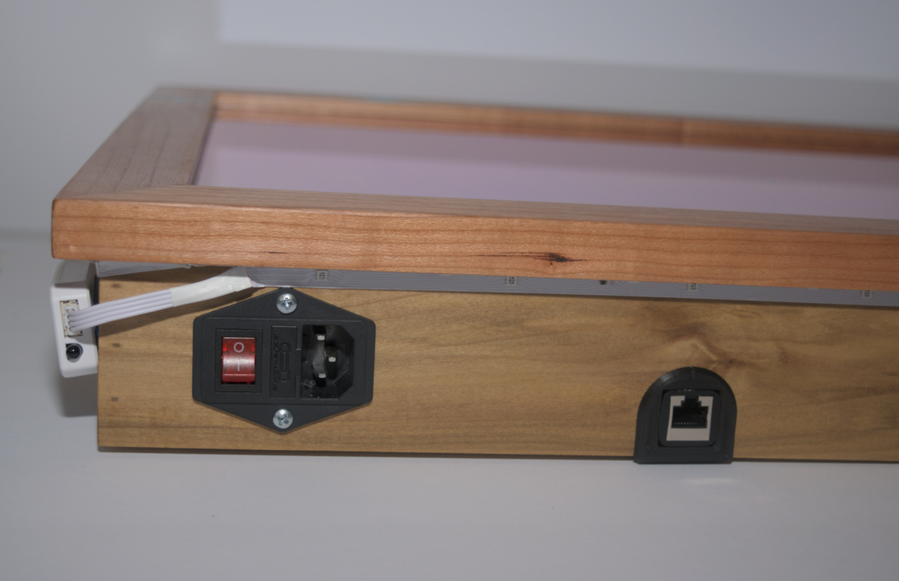
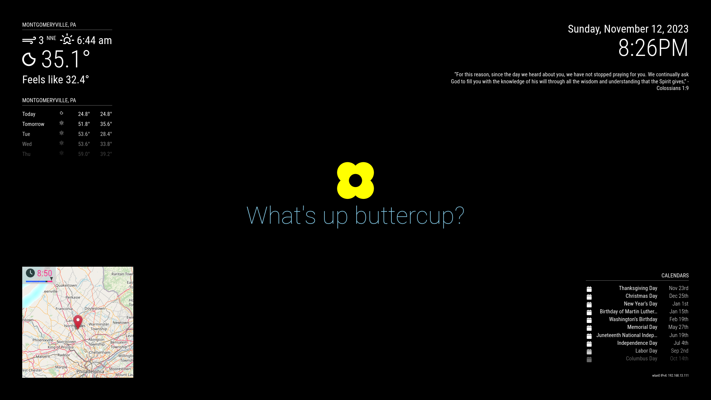
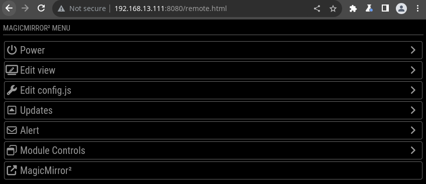
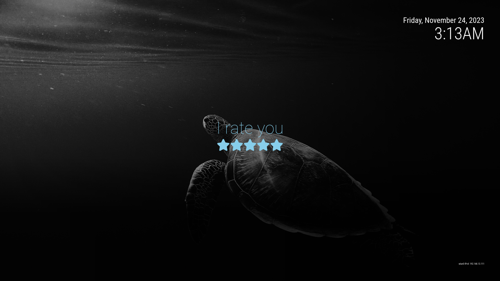
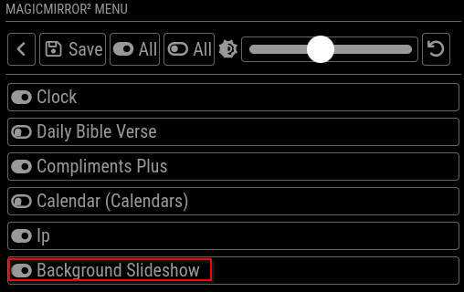

# Abby's Mirror: Quick Start 

On the back of your mirror was a letter with a QR code that brought you hear. This letter also contained the passwords you will need as you follow this guide. 

## Initial Startup

  1. Power the mirror via the cord, connector, and switch on the bottom of the mirror. 
  1. Once powered on the mirror application should start join the WiFi automatically, alternately you can use the LAN connector near the power connector

The mirror application should start on it's own

## Default Module Config

Your mirror will show you different information depending upon time of day, weather etc. 

*Read the [config page](../Guide.md) for full details on what is displayed when.* 

## Advanced Functionality  

Once on the network the IP address will be displayed in the lower right hand corner (above purple). Use this address to access other features of your mirror as described below. 

### Web interface 

Your mirror has a web interface that allows you to do things like show/hide modules, set the brightness, turn it on/off, etc. 

Use the IP address in conjunction with **:8080/remote.html** to find this interface from any browser on the same wifi network.  

*Note: if you have an Apple device you can also use abby_mirror.local in place of the numerical IP*

e.g.
  * http://abby_mirror.local:8080/remote.html
  * http://192.168.13.111:8080/remote.html

### Background images (file sharing)

Your mirror has the ability to display fullscreen background images. 

Enable the module via the remote page mentioned above. 

These images cycle randomly and are pulled from a shared folder. This shared folder may be accessed by any computer on the same wifi network. 

Read the [usage guide](../Guide.md) for instruction on how to upload new background images. 

