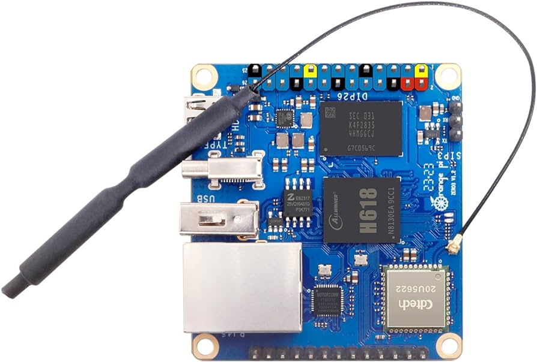

# Abby's Mirror: About

Dear Abby,

This project is the collective effort of your Aunt Jill, Uncle, Dave, Jim, Monica, and myself. 
May it bring you many years of joy.

 

{image TBD}

## Pages

  * [Quick Start](./QuickStart.md) (start here to get the basics)
  * [Guide](./Guide.md) Detailed informaiton about using all features of your mirror
  * [Build Log](./BuildLog.md) This page shows a history of how your mirror came to be
  * [Print files](./Print.md) stl files of 3D printed parts used
  * The rest of this page contains basic information about your mirror.

## Hardware
This section documents the hardware used to create your mirror.
| Object | Description | Ref | Pic | 
| :--- | :---: | :---: | :---: |
| Orange Pi Zero 3  | Hardware / CPU | [Orangepi website](http://www.orangepi.org/html/hardWare/computerAndMicrocontrollers/details/Orange-Pi-Zero-3.html) |  |
| Philips 27" monitor | Monitor | [Philips V-line](https://www.usa.philips.com/c-p/271V8L_27/monitor-lcd-monitor) |  |
| One way mirror glass | Provided by Alderfer | [Alderfer](https://alderferglass.com/) |  | 
| Frame | Poplar frame with Cherry trim | [trees](https://www.arborday.org/trees/treeguide) |  |  
| Transformers | 120v to [5v & 24v] | [120v to 24v](https://www.amazon.com/24V-LED-Power-Supply-Transformer/dp/B09DKR1F71)   [120v to 5v](https://www.amazon.com/Converter-Module-Universal-Isolated-Switching/dp/B08ZSW2PP8) |  |
| Fans | 24v 60mm fans | [Fans](https://www.amazon.com/WINSINN-Brushless-Computer-Motherboard-Graphics/dp/B07R3WCKCX) |  | 
| Fan controller | PWM controller | [PWM Controller](https://www.amazon.com/Motor-Controller-Control-Switch-Dimmer/dp/B08T5TJWYH) |  |

## Software
This is the software used to create and augment your mirror.
| Object | Description | Ref | 
| :--- | :--- | :--- | 
| Operating System | Debian Bookworm | [Orange Pi OS Downloads](http://www.orangepi.org/html/hardWare/computerAndMicrocontrollers/service-and-support/Orange-Pi-Zero-3.html) | 
| MagicMirror | Primary application | https://magicmirror.builders/ | 
| Samba | Windows file sharing | https://www.samba.org/ |

## Magic Mirror Config
This section describes how your mirror has been configured (default). This configuration can be chagned and customized however desired.

### Modules 
Your mirror has several modules that extend it's functionality, below is the list of currently installed modules. There are many modules available, read more about modules [via this link](https://github.com/MichMich/MagicMirror/wiki/3rd-party-modules).
| Module | Desc |  
| :--- | :--- | 
| MMM-Remote | Provides a web interface to interact and manage your mirror | 
| MMM-Scheduler | Schedule module visibility, brightness, etc | 
| Weather | Current and forecast | 
| Clock | it's a clock | 
| MMM-DailyBibleVerse | Verse of the day from BibleGateway.com | 
| MMM-RAIN-MAP | Shows a radar map when it's raining | 
| Compliments Plus | Abby's favorite plugin, originally from here https://github.com/hangorazvan but appears to be abandoned.  | 
| MMM-BackgroundSlideshow | Mirror wallpaper, rotates from samba share folder | 

### Default Module Config and Layout
This section describes how the default modules are configured.

| Module | Location (default) | Color | Displays | 
| :--- | :--- | :--- | :--- |
| Current weather | top left | green | always |
| Forecast | top left | red | always |
| Rain Map | lower left | yellow | when raining |  
| Clock | top right | cyan | always | 
| Daily verse | top right | magenta | Sunday | 
| Compliments plus | center | blue | always |
| Calendar | lower right | orange | daily 6:00AM to 10:00PM | 
| IP address | lower right | purple | always (until turned off) |
| * | * | * | all modules dimmed to 40% at 10PM | 

Next: Read the [usage guide](Guide.md)

